# VoltGrid — Slide 3 Flowchart & System Architecture Guide

> **SIH 2026 Presentation Template — Slide 3**: System Flow Chart / Process & Methodology.  
> **Reference Model**: Inspired by the SIH 2025 Finalist Architecture Flowchart (ZyraNav / Helix House).  
> **Platform**: VoltGrid — Intelligent EV Energy & Route Optimization Platform.

---

## 1. Flowchart Architecture Concept (The 4 Functional Blocks)

In the reference SIH 2025 finalist slide, the flowchart succeeded because it avoided a single straight line. Instead, it showed:
1. **The Primary Core Flow** (Trip request $\rightarrow$ Road geometry $\rightarrow$ Energy math $\rightarrow$ Feasibility check).
2. **The Adaptive Optimization Block** (Multi-stop forward convergence, payload & aerodynamic drag adjustments).
3. **The Predictive ML & Scoring Loop** (Logistic regression vacancy model at ETA, venue profiles, queue forecasting).
4. **The Failover & Autonomous Recovery Branches** (In-transit outage reroute in <500 ms, overnight hotel stays, emergency 15A swapping kiosks).

```
┌───────────────────────────────────────────────────────────────────────────────────────────────────────────┐
│                                       VOLTGRID SYSTEM FLOW CHART                                          │
├───────────────────────────────────────────────────────────────────────────────────────────────────────────┤
│                                                                                                           │
│       ┌──────────────────────┐                                                                            │
│       │  TRIP REQUEST INPUT  │ ◄── Origin, Destination, EV Model (26 presets), Initial SoC%, Payload     │
│       └──────────┬───────────┘                                                                            │
│                  │                                                                                        │
│                  ▼                                                                                        │
│       ┌──────────────────────┐                                                                            │
│       │ API SECURITY GATEWAY │ ◄── Zod .strict() Schema, 128 KiB Body Cap, Token-Bucket Rate Limiter      │
│       └──────────┬───────────┘                                                                            │
│                  │                                                                                        │
│                  ▼                                                                                        │
│       ┌──────────────────────┐                                                                            │
│       │  OSRM ROUTING ENGINE │ ◄── High-precision highway road geometry, turn-by-turn distance & duration│
│       └──────────┬───────────┘                                                                            │
│                  │                                                                                        │
│                  ▼                                                                                        │
│       ┌──────────────────────┐                                                                            │
│       │ DIRECT FEASIBILITY?  │                                                                            │
│       └────┬────────────┬────┘                                                                            │
│            │            │                                                                                 │
│     [YES] ─┘            └── [NO: Charging Required]                                                       │
│       │                            │                                                                      │
│       │                            ▼                                                                      │
│       │                 ┌──────────────────────────────────────────────┐                                  │
│       │                 │      CORRIDOR OPTIMIZATION PIPELINE          │                                  │
│       │                 │  • Spatial Bounding Box (Corridor Filter)    │                                  │
│       │                 │  • findMultiStop() Forward Progress Engine   │                                  │
│       │                 │  • Visited Loop Suppression (visitedIds)     │                                  │
│       │                 └──────────────────────┬───────────────────────┘                                  │
│       │                                        │                                                          │
│       │                 ┌──────────────────────┴───────────────────────┐                                  │
│       │                 ▼                                              ▼                                  │
│       │  ┌─────────────────────────────┐        ┌──────────────────────────────────────────┐              │
│       │  │ FIRST-PRINCIPLES PHYSICS    │        │ PREDICTIVE AVAILABILITY ML ENGINE        │              │
│       │  │ • Wh/km = Base × M_occupancy│        │ • Logistic Regression: P(avail) = σ(w·x+b│              │
│       │  │ • Pillion Drag Penalty (+15%)        │ • Venue Demand Curves (highway/mall/hub) │              │
│       │  │ • Cargo Load (+0.04 Wh/km/kg│        │ • Historical Operator Reliability Score  │              │
│       │  │ • Chemistry: LFP vs. NMC    │        │ • Queue Time Degradation Forecast at ETA │              │
│       │  └──────────────┬──────────────┘        └────────────────────┬─────────────────────┘              │
│       │                 │                                            │                                    │
│       │                 └──────────────────────┬─────────────────────┘                                    │
│       │                                        │                                                          │
│       │                                        ▼                                                          │
│       │                 ┌──────────────────────────────────────────────┐                                  │
│       │                 │       MULTI-CRITERIA STATION SCORING         │                                  │
│       │                 │ Score = w_a·P_avail - w_d·Detour - w_t·Time  │                                  │
│       │                 │         + w_r·Reliability - w_c·Cost         │                                  │
│       │                 └──────────────────────┬───────────────────────┘                                  │
│       │                                        │                                                          │
│       │                                        ▼                                                          │
│       │                 ┌──────────────────────────────────────────────┐                                  │
│       │                 │ IN-TRANSIT OUTAGE DETECTED? (Sim / Real CPO) │                                  │
│       │                 └────┬────────────────────────────────────┬────┘                                  │
│       │                      │                                    │                                       │
│       │               [NO] ──┘                             [YES] ─┘                                       │
│       │                 │                                     │                                           │
│       │                 │                                     ▼                                           │
│       │                 │                      ┌─────────────────────────────┐                            │
│       │                 │                      │ AUTONOMOUS RE-ROUTING       │                            │
│       │                 │                      │ • /api/reroute (<500 ms)    │                            │
│       │                 │                      │ • Recalculates reachable hub│                            │
│       │                 │                      └──────────────┬──────────────┘                            │
│       │                 │                                     │                                           │
│       │                 └──────────────────┬──────────────────┘                                           │
│       │                                    │                                                              │
│       ▼                                    ▼                                                              │
│  ┌──────────────────────────────────────────────────────────────────────────┐                             │
│  │                     FINAL OPTIMIZED MOBILITY OUTPUT                      │                             │
│  │  • Interactive Leaflet Map Polyline with Multi-Stop Recharge Delta Bars  │                             │
│  │  • Guaranteed Slot Booking via Razorpay (Cryptographic HMAC Verification)│                             │
│  │  • Digital QR Charging Pass for CPO Gate Validation                      │                             │
│  │  • Operator Console: Grid Load Telemetry, Transformer Caps, SOS Dispatch │                             │
│  └──────────────────────────────────────────────────────────────────────────┘                             │
│                                                                                                           │
└───────────────────────────────────────────────────────────────────────────────────────────────────────────┘
```

---

## 2. Mermaid Diagram Code
*(Copy and paste this into Mermaid Live Editor or your markdown viewer)*

```mermaid
flowchart TD
    %% Styling
    classDef inputStyle fill:#e0f2fe,stroke:#0284c7,stroke-width:2px,color:#0f172a;
    classDef processStyle fill:#f1f5f9,stroke:#64748b,stroke-width:2px,color:#0f172a;
    classDef decisionStyle fill:#fef3c7,stroke:#d97706,stroke-width:2px,color:#0f172a;
    classDef physicsStyle fill:#ecfdf5,stroke:#059669,stroke-width:2px,color:#0f172a;
    classDef mlStyle fill:#fdf4ff,stroke:#a855f7,stroke-width:2px,color:#0f172a;
    classDef outputStyle fill:#0f172a,stroke:#38bdf8,stroke-width:2px,color:#ffffff;
    classDef alertStyle fill:#fee2e2,stroke:#dc2626,stroke-width:2px,color:#991b1b;

    INP[("<b>1. TRIP REQUEST INPUT</b><br>Origin, Destination, EV Model (26 presets)<br>Starting SoC%, Payload Mass, Preference")]:::inputStyle
    SEC["<b>2. API SECURITY BOUNDARY</b><br>Zod Strict Validation • 128 KiB Payload Cap<br>Token-Bucket IP Rate Limiting (120 req/min)"]:::processStyle
    OSRM["<b>3. OSRM DRIVING ENGINE</b><br>Pairwise Road Geometry • Highway Distance (km)<br>10s Timeout with Haversine Fallback"]:::processStyle
    
    DEC1{"<b>4. DIRECT FEASIBLE?</b><br>Can arrive with ≥ desired<br>arrival battery reserve?"}:::decisionStyle
    
    DIR["<b>DIRECT 0-STOP ROUTE</b><br>Continuous highway polyline<br>Guaranteed battery buffer"]:::outputStyle

    OPT["<b>5. CORRIDOR OPTIMIZATION ENGINE</b><br>Spatial Bounding Box (Corridor Filter)<br>findMultiStop() Forward Directional Progress<br>visitedIds Ping-Pong Loop Suppression"]:::processStyle

    PHY["<b>6. FIRST-PRINCIPLES PHYSICS CORE</b><br>Wh/km = Base × M_occupancy × M_terrain × M_weather + P_cargo<br>Pillion Wind Drag (+15%) • Luggage Mass Penalty<br>Chemistry Ceilings: LFP (100%) vs NMC (85-90%)"]:::physicsStyle

    ML["<b>7. PREDICTIVE AVAILABILITY ML</b><br>Logistic Regression: P(avail at ETA) = σ(w·x + b)<br>Venue Profile Demand Curves (highway, transit, mall)<br>Historical CPO Reliability Score • Queue Decay Math"]:::mlStyle

    SCORE["<b>8. MULTI-ATTRIBUTE SCORER</b><br>Score = w_avail·P_avail - w_detour·D - w_time·T<br>+ w_rel·R - w_cost·C"]:::processStyle

    DEC2{"<b>9. IN-TRANSIT OUTAGE?</b><br>Charger offline or tripped?"}:::decisionStyle

    REROUTE["<b>AUTONOMOUS RE-ROUTING</b><br>/api/reroute in <500 ms<br>Instant diversion to backup CPO hub"]:::alertStyle

    OUT[("<b>10. MULTI-STAKEHOLDER OUTPUT</b><br>• Driver: Interactive Leaflet Map with Leg-by-Leg Recharge Delta Bars<br>• Reservation: Guaranteed Bay Booking + Razorpay HMAC-SHA256 Verification<br>• Access Pass: Encrypted Digital QR Pass for Station Turnstiles<br>• Operator Console: Grid Load Peak Balancer & Emergency SOS Rescue Dispatch")]:::outputStyle

    %% Connections
    INP --> SEC
    SEC --> OSRM
    OSRM --> DEC1
    DEC1 -- "YES (Arrival SoC ≥ Reserve)" --> DIR
    DEC1 -- "NO (Charging Required)" --> OPT
    OPT --> PHY
    OPT --> ML
    PHY --> SCORE
    ML --> SCORE
    SCORE --> DEC2
    DEC2 -- "NO (Normal Operation)" --> OUT
    DEC2 -- "YES (Charger Outage Detected)" --> REROUTE
    REROUTE --> OUT
    DIR --> OUT
```



---

## 3. How to Draw This on Slide 3 (Canva / PowerPoint / Figma Instructions)

To recreate the look of the **SIH 2025 Finalist (ZyraNav)** slide:
1. **Left Side (30% width)**:
   * Keep your **Tech Stack & Proof of Work** (Next.js 16, OSRM, Leaflet, PostGIS, 54 unit tests, 925+ stations, GitHub link).
2. **Right Side (70% width) — FLOW CHART**:
   * **Box 1 (Top Blue)**: `TRIP INPUT & SECURITY` (Inputs $\rightarrow$ Zod validation $\rightarrow$ OSRM engine).
   * **Central Decision Diamond (Yellow)**: `DIRECT FEASIBLE?`
     * Left Arrow (Green): `0-Stop Direct Route`.
     * Right Arrow: Leads into the **Corridor Charging Pipeline**.
   * **Box 2 (Emerald Green)**: `FIRST-PRINCIPLES PHYSICS CORE` (Wh/km, Pillion Drag $+15\%$, Cargo mass, LFP/NMC chemistry).
   * **Box 3 (Purple/Lilac)**: `PREDICTIVE AVAILABILITY ML ENGINE` (Logistic Regression $\sigma(\mathbf{w}\cdot\mathbf{x}+b)$, venue profiles, queue forecasting).
   * **Box 4 (Orange)**: `MULTI-ATTRIBUTE SCORING` (Detour, Power, Availability, Cost, Reliability).
   * **Sidecar Alert Box (Red/Pink)**: `AUTONOMOUS RE-ROUTING (<500ms)` showing how outages trigger instant in-flight recovery.
   * **Bottom Box (Dark Navy)**: `MULTI-STAKEHOLDER OUTPUT` (Driver map with delta bars, Razorpay QR booking pass, Operator grid HUD).

---

## 4. The 30-Second Flowchart Pitch for Judges

When you point to this diagram during the evaluation:

> *"Judges, looking at our central flowchart:
> 
> When a user enters their trip, it doesn't just ping a database. The request passes through our **Zod security gate**, and **OSRM** extracts the real highway road geometry.
> 
> At our first decision gate, we test if the destination is reachable directly. If not, our **Corridor Optimization Engine** activates two parallel brains:
> 1. Our **First-Principles Physics Core** calculates real-world Wh/km consumption, factoring in pillion aerodynamic drag, passenger weight, and battery chemistry.
> 2. Simultaneously, our **Logistic Regression ML Model** forecasts charger vacancy at the driver's estimated time of arrival.
> 
> Our multi-attribute scoring function selects the optimal stop. And notice our safety branch on the right: if an assigned charger trips while the car is in motion, our **autonomous rerouting engine** recalculates in under 500 milliseconds, outputting a guaranteed slot booking, a digital QR pass, and live operator telemetry."*
